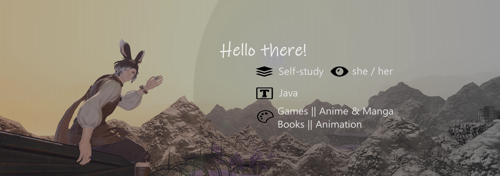

### 
Hello! I'm Kate, in process of learning to maybe becoem QA one day!
### About me:
- 🌱 I’m currently learning: JAVA and picking on 3D Animation (although this is a hobby)
- 😄 Pronouns || Age : she/her || 27
- Courses done: Codeacademy (JAVA Basics) || EPAM Academy (currently)
- 🔭 I’m currently working on: JAVA projects from EPAM coursework
- ⚡ Programs: VS Code, Blender
- 💬 Ask me about : anything, really! I like to get to know net things and people!
### Ideas/Projects:
To be added-

